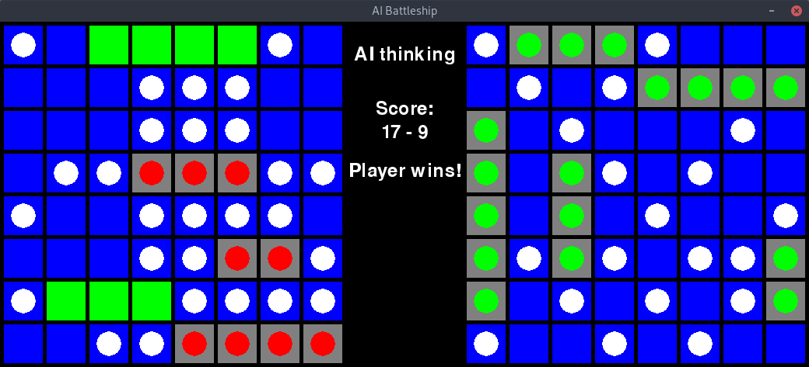

# AI Battleship



## Team Members
- Coleman Nugent
- Mahsha Tizhoush
- Hamesh Kumar Sharma
- Adam Villarosa

## About the Game
Layout: 10x10 grid
Carrier	= 5. Battleship = 4. Cruiser = 3. Submarine = 3. Destroyer = 2

[Wikipedia Article](https://en.wikipedia.org/wiki/Battleship_\(game\)#Description).
The game is played on four grids, two for each player. The grids are typically square – usually 10×10 – and the individual squares in the grid are identified by letter and number.[7] On one grid the player arranges ships and records the shots by the opponent. On the other grid the player records their own shots.

Before play begins, each player secretly arranges their ships on their primary grid. Each ship occupies a number of consecutive squares on the grid, arranged either horizontally or vertically. The number of squares for each ship is determined by the type of the ship. The ships cannot overlap (i.e., only one ship can occupy any given square in the grid). The types and numbers of ships allowed are the same for each player. These may vary depending on the rules.

## How to Run
First make sure you have pygame installed.
```
sudo python3 Battleship.py
```

## The Files

Battleship.py is the main file where the user runs on the command line ‘python Battleship.py’. As of now, this file only contains a few lines of code that start up the game. The to-do for this file is to add parameters to change the gameplay, such as the board size. The default board size will be a 10 by 10 grid as that is the standard board size listed in the rulebook. This file has remained the same since the last update.

Controller.py contains the class Game. The constructor sets up the human board, sets up the AI board, sets the human’s turn as true, initializes the turn count to 0, and sets the size to 10. The size of both boards (human and AI) are a 10x10 grid as of now. There are also three functions within the Game class: placeShips(), gameLoop(), and play(). 
placeShips() will add the ships to the board. The player will specify where the ships are placed on their side of the board, while the AI will place its ships randomly. Since the last update, we have implemented the option for players to choose where they want to place their ships. The user is now prompted to select where they want to place each individual ship. We also now allow the player to select what orientation they want to place their ships. This is done by rotating the ship based off of “left”, “right”, “up”, or “down”. Since the original battleship game did not allow for ships to be orientated diagonally, we only allowed ships to be placed and rotation vertically/horizontally. 
gameLoop() will keep the game window up until the user exits or when the game ends. It also prints out the coordinates of the mouse when clicked onto the console.
play() sets the display of the game window, prompts the user to place ships calls the placeShips() method, and enters gameLoop().

Model.py contains the classes Segment, ShipSegment, WaterSegment, Ship, and Board.
Class ShipSegment’s constructor sets beenhit to false. It also contains the method hit(), hit() will be called if part of the ship has been hit and it sets beenhit to true. It will then call updateHits().
Class WaterSegment sets miss to false.
Class Ship initializes sunk to false, sets the size of the ship, initializes hits to 0, and initializes a list of segments. It also contains the method updateHits(); this method keeps track of the hits in the ship segments. If all the hits are == to the size of the ship, then sunk = true. Each ship is also defined in this class. Destroyer == 2. Submarine == 3. Cruiser == 3. Battleship == 4. Carrier == 5.
Class Board creates the game board. It initializes each cell to None. Within this class, there are three functions: at(x,y), valid(x,y), and addShip(x, y, size, slope); at(x,y) returns the x and y coordinate of the cell; valid(x,y) returns true if the x and y coordinates are within the boundaries of size of the board else it will return false. addShip (x, y, size, slope) sets a given ship at (x,y) with a given slope and size. The slope is defined as one of the following: “down”, “left”, “up”, “right” which progress clockwise. It returns either true if the placement succeeded, or false if it failed. It will also create a ship and create a ShipSegment for each location. This code has remained the same since our last update. 

View.py adds the visuals for the gameboard with the Display class. This sets up the width, height, and title of the game window. The background is defined as C_BACKGROUND (0, 0, 0) which is black. The player ship is defined as C_PLAYERSHIP (0, 255, 0) which is green. A player is hit defined as C_PLAYERHIT (255, 0, 255) which is pink. The water is defined as C_WATER (0, 0, 255) which is blue. The AI ship is defined as C_AISHIP (255, 0, 0) which is red. This class also starts and ends pygame. Since the last update, we have fine tuned the size of the gutter and margins of the cells and board for the sake of clarity. We also reorganized the way the game board is displayed. On top of that, we added several functions into this file to help with painting the game board. The updateScreen function has a feature allows the users to enter a debug state where they can see in real time the probability of each tile being selected represented by white being the highest probability and with black being the lowest probability.

Ai.py contains the algorithm, classes, and functions that our AI uses when determining the most optimal tile to select. This file consists of the SimpleAI class, which is a very basic algorithm we made for testing purposes. This algorithm does not use any AI or heuristics in determining the optimal tile to select. It simply guesses a random row and column when called. The BetterAI class is our algorithm that uses hueristics to determine the tile that is more likely to contain a ship piece. This class is composed of the bestGuess function, which is used to determine which tiles have the highest probability of  containing a ship and handling the event of there being a tie between two or more tiles. The updateSurrounding function is used to update the probabilities of the tiles that surround a targeted cell. The makeMove function calls the bestGuess function and shoots at the coordinates given by the bestGuess function. The function also sets the probability of a selected tile to 0 in order to prevent that tile from being chosen again during a game. It then calls the updateSurrounding function on the coordinates generated by the bestGuess funciton. 
